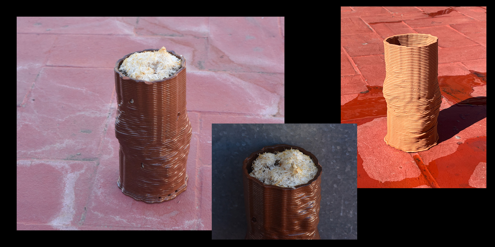
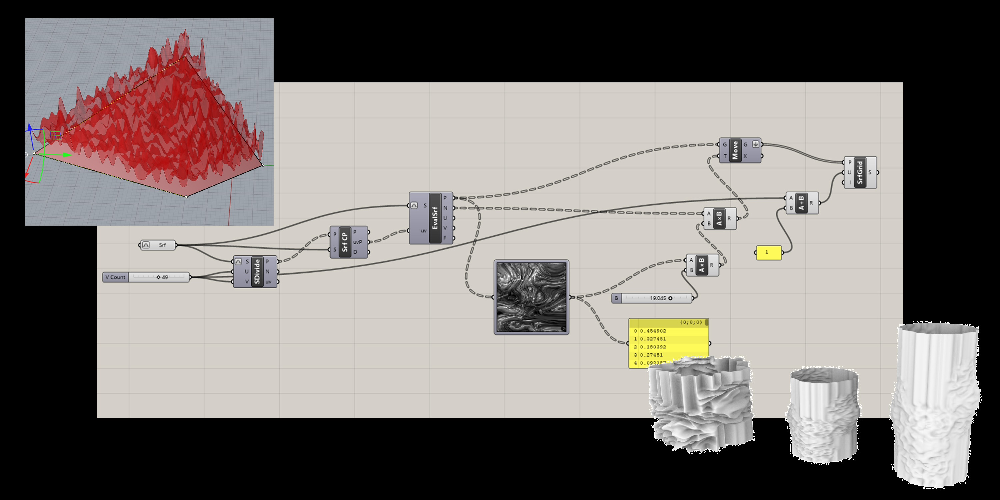
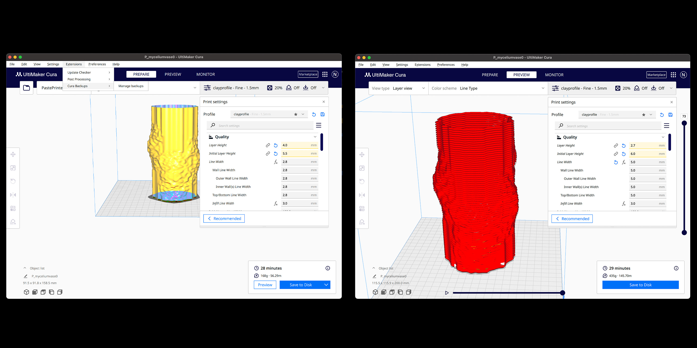
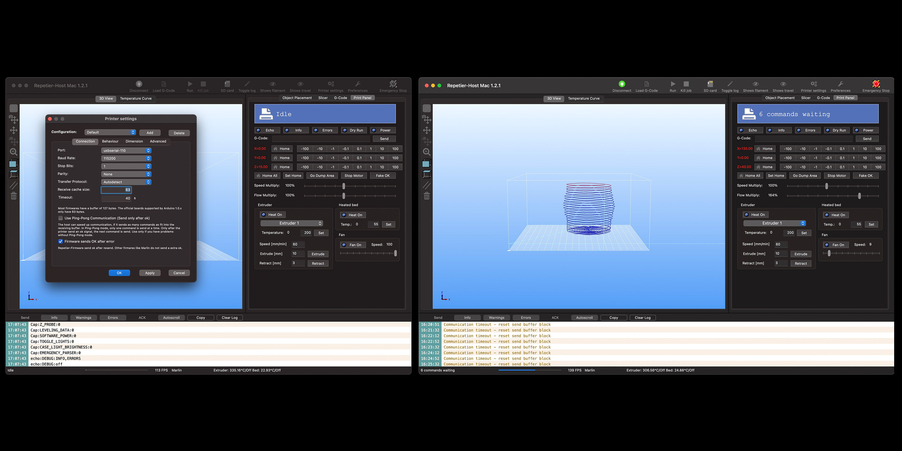
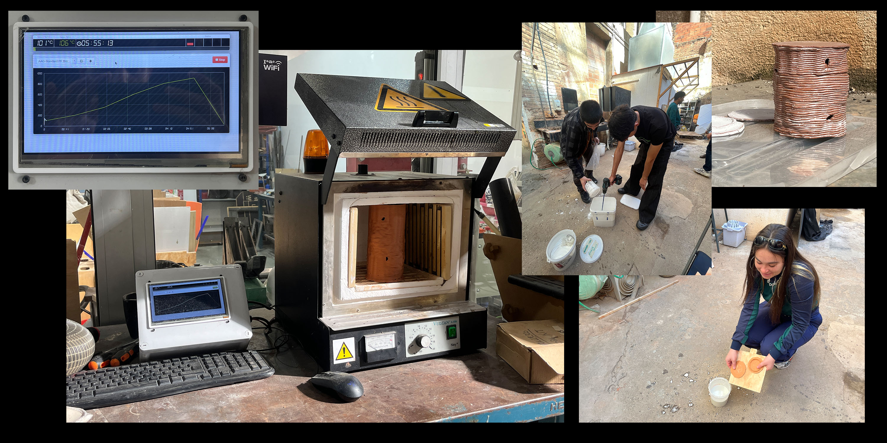

# 3D Printing Clay: Mycelium Cultivation in a 3D Printed Clay Structure

## Intro: 3D Paste Printing

Paste 3D printers offer a world of possibilities by handling diverse materials like clay, silicone, and even biological substances. This technology empowers us to explore new frontiers in creativity and innovation. With paste printing we can achieve personalized objects with unique textures become achievable. However, hacking and using 3D printers for clay printing involves technical challenges such as the modification of the equipment and the slicing software settings (grasshopper or cura). Despite these hurdles, hacking a 3D printer for clay opens doors to crafting intricate ceramic or paste-printed objects with revolutionary designs, igniting a fresh wave of imagination and discovery.

## Step 1: 3D Modeling with Grasshopper

We developed different geometries using rhino+grasshopper. For this excercise we managed to generate a texture following the pattern of a picture. In this case we selected a photo of a mycelium network. 
The algorithm took the points of the surface's geometry and moves them according to the image's pattern. Throught parametric variables we were able to play with the resolution and bump of the surface until we got the selected one.

## Step 2: Cura 

To be able to paste print the geometry, we saved the rhino file into .stl format in order for it to be exported to **Cura**.
In Cura we had to add the fablab's paste printer, as well as to add the correct clay material profile in order to print propertly. 
Later we had to slice the geometry taking into account variables such as the noozle diameter and the initial layer height. Once the slicing is ready, we generated the g-code.

In the attached image you can see the final parameters that we used.

## Step 3: Reptetier Host

In order for the sliced geometry to be read by the printer, we needed to download **Repetier Host**. This software allowed us to play with the position of the printer's noozle and the screw's speed (which determins the material's flow). 
We experienced some struggles with this software, as it was difficult to enable and mantain a connection with the printer. 
Also several failed printing attempts were made as we had to play with every variable from cura, Repetier Host, the compressor's pressure and the clay's consistency.

If anybody is facing troubles to make Repetier Host work for this technique, this is the steps that we suggest:

1. Get the .gcode file from Cura using the material clay profile (link at bottom).
2. Insert the Extruder in the machine.
3. Open Repetier Host in your PC.
4. Turn on 3D Printer, waiting for the initial animation to be completed.
5. Connect the cable from the machine to the PC.
6. Enable Connection from Repetier Host, waiting for the animation to be completed.

Sometimes you could face a "Command Waiting" line in the top-right corner of the Print Panel, in this case, just refresh the connection or repeat the steps 3-6.

In the attached image you can see the final parameters that we used for our print.

## Step 4: Printing with Clay 

Turning our digital design into a tangible clay structure posed challenges, especially in preparing for 3D printing. It took us a bunch of tries, considering factors like wall thickness and print speed.

## Step 5: Firing & Glazing

Glazing a 3D-printed clay piece is a key step that blends the strength and beauty of traditional ceramics with the innovation of 3D printing. First, the piece is bisque fired to make it strong yet able to soak up the glaze. Next, the glaze is applied, which might be done by dipping, brushing, or spraying to suit the intricate design. Sometimes, a wax resist is used to keep glaze off areas like the bottom, preventing it from sticking during the final firing. This last firing melts the glaze onto the clay, creating a glassy surface that's both protective and visually appealing. It's important to choose the right glaze for the clay to avoid flaws like cracks or peeling. This process transforms the 3D-printed piece, making it more durable and enhancing its look, showing off the unique blend of old craftsmanship and new technology.

## Step 5: Adding Mycelium 
1. Prepare the substrate. In this case, small amount of coffee was added for additional nutrients.
2. Place the substrate in a heat resistent bag to sterilize it in the pressure cook.
3. Put the pressure cook in Meat mode (fablab biolab) for 45 min.
4. Sterilize EVERYTHING else with alcohol and use gloves.
5. Put on a flame to create a sterilizing bubble where you can work in.
6. Place a layer of dirt to support the conection piece.
7. Take the subsrate out of the pressure cook and add sculpting nutritional mix.
8. Add straw innoculated with mycelium and mix.
9. Add the mix into the vase.

## Results
In our project, we explored blending traditional materials, advanced tech, and living organisms. We created a structure that joins ceramic arts, 3D printing precision, and mycelium natural growth.
Our main challenge was using clay in 3D printing, which required rethinking design to clay's properties and 3D printing specifics. We aimed for stability and strange shapes despite common issues like collapsing structures.
Grasshopper, was our help for that, enabling rapid design iterations for the structure.

## Resources: 
- Material Clay profile: https://github.com/fablabbcn/aei-3dslicer-curaprofiles.git.
- FabLabBcn Paste printer Hack: https://github.com/fablabbcn/aei-kit-impresion-pasta/tree/main 
- Printing Nozzle Files: https://www.amazon.es/dp/B086Y7CLLC?psc=1

